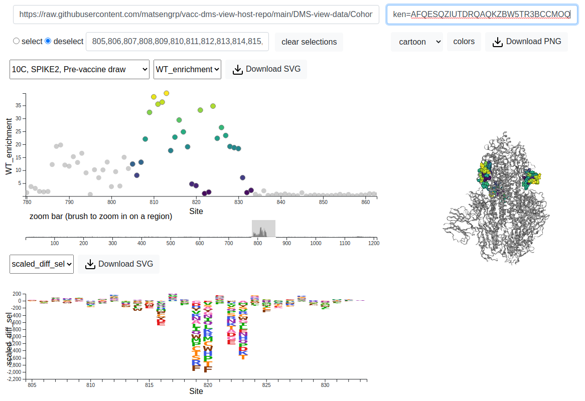

# DMS data presented in Garrett, Galloway et. al. 2021 

**Published in** [elife](http://dx.doi.org/10.7554/eLife.73490).
Authors: Meghan E. Garrett\*, Jared G. Galloway\*, Caitlin Wolf, Jennifer K. Logue, Nicholas Franko, Helen Chu, Frederick A. Matsen IV^, Julie Overbaugh^

\* these authors contributed equally to this work.
^ co-corresponding authors

A repository for hosting all Phage Deep Mutational Scanning (Phage-DMS data)
presented in *Comprehensive characterization of the antibody responses to SARS-CoV-2 Spike protein finds additional vaccine- induced epitopes beyond those for mild infection*.
Here, we break our entire dataset into 
more manageable subsets and provide a link to view 
all the data using the 
[DMS-view tool](https://dms-view.github.io/docs/tutorial.html).
Below, we describe the data subsets which split by cohort and sample condition 
while keeping all respective time points and replicates from a single 
participant (biologically distinct) 
in the same grouping. 
Simply click on the link next to the 
participant list and you'll be re-directed to view all data for the 
samples listed within the interactive tool. 

## Quick Example

To observe the enrichment and/or mutation-induced pathways of escape data for any of the samples in the manuscript, follow these steps, replacing Participant 10C with any participant of your choosing.

1. Click on the relevant dataset link [Dataset #1](https://dms-view.github.io/?markdown-url=https%3A%2F%2Fraw.githubusercontent.com%2Fmatsengrp%2Fvacc-dms-view-host-repo%2Fmain%2FREADME.md&data-url=https%3A%2F%2Fraw.githubusercontent.com%2Fmatsengrp%2Fvacc-dms-view-host-repo%2Fmain%2FDMS-view-data%2FCohort-2---Infected-to-Vacc-%25231.csv&condition=103C%2C+SPIKE1%2C+Post-vaccine+draw+1&site_metric=site_WT_enrichment&mutation_metric=mut_scaled_diff_sel&selected_sites=1145&protein-data-color=&protein-other-color=&pdb-url=https%3A%2F%2Fraw.githubusercontent.com%2Fmatsengrp%2Fvacc-dms-view-host-repo%2Fmain%2FDMS-view-data%2F6vxx.pdb) below under *Cohort 2 (HAARVI)*, which will pull up DMS-View website
2. In the "condition" drop-down menu, select "10C, SPIKE2, Pre-vaccine draw". SPIKE\<X\> is the batch replicate identifier - Select the respective *SPIKE2* to see the replicate. So the pattern, generally, for condition naming id "\<Participant ID\>, \<Batch Replicate\>, \<Time point\>"
3. Brush over the enriched region around peptide location 800.
4. Brush over the peptides you would like to see enrichment for.

  

## Cohort 1 - MODERNA TRIAL

[Dataset #1](https://dms-view.github.io/?markdown-url=https%3A%2F%2Fraw.githubusercontent.com%2Fmatsengrp%2Fvacc-dms-view-host-repo%2Fmain%2FREADME.md&data-url=https%3A%2F%2Fraw.githubusercontent.com%2Fmatsengrp%2Fvacc-dms-view-host-repo%2Fmain%2FDMS-view-data%2FCohort-1---Moderna-Vaccinated-%25231.csv%3Ftoken%3DAFQESQ4KZUXDRURXIBGFFITBKTJRG&condition=M01%2C+SPIKE1%2C+119+Days+post-vaccination&site_metric=site_WT_enrichment&mutation_metric=mut_scaled_diff_sel&selected_sites=&protein-data-color=&protein-other-color=&pdb-url=https%3A%2F%2Fraw.githubusercontent.com%2Fmatsengrp%2Fvacc-dms-view-host-repo%2Fmain%2FDMS-view-data%2F6vxx.pdb) : ['M01', 'M02', 'M03', 'M04', 'M05', 'M06']

[Dataset #2](https://dms-view.github.io/?markdown-url=https%3A%2F%2Fraw.githubusercontent.com%2Fmatsengrp%2Fvacc-dms-view-host-repo%2Fmain%2FREADME.md&data-url=https%3A%2F%2Fraw.githubusercontent.com%2Fmatsengrp%2Fvacc-dms-view-host-repo%2Fmain%2FDMS-view-data%2FCohort-1---Moderna-Vaccinated-%25232.csv&condition=M07%2C+SPIKE1%2C+119+Days+post-vaccination&site_metric=site_WT_enrichment&mutation_metric=mut_scaled_diff_sel&selected_sites=1139%2C1140%2C1141%2C1142%2C1143%2C1144%2C1145%2C1146%2C1147%2C1148%2C1149%2C1150%2C1151%2C1152%2C1153%2C1154%2C1155%2C1156%2C1157%2C1158%2C1159%2C1160%2C1161%2C1162%2C1163%2C1164%2C1165&protein-data-color=&protein-other-color=&pdb-url=https%3A%2F%2Fraw.githubusercontent.com%2Fmatsengrp%2Fvacc-dms-view-host-repo%2Fmain%2FDMS-view-data%2F6vxx.pdb) : ['M07', 'M08', 'M09', 'M10', 'M11', 'M12']

[Dataset #3](https://dms-view.github.io/?markdown-url=https%3A%2F%2Fraw.githubusercontent.com%2Fmatsengrp%2Fvacc-dms-view-host-repo%2Fmain%2FREADME.md&data-url=https%3A%2F%2Fraw.githubusercontent.com%2Fmatsengrp%2Fvacc-dms-view-host-repo%2Fmain%2FDMS-view-data%2FCohort-1---Moderna-Vaccinated-%25233.csv&condition=M13%2C+SPIKE1%2C+119+Days+post-vaccination&site_metric=site_WT_enrichment&mutation_metric=mut_scaled_diff_sel&selected_sites=1161&protein-data-color=&protein-other-color=&pdb-url=https%3A%2F%2Fraw.githubusercontent.com%2Fmatsengrp%2Fvacc-dms-view-host-repo%2Fmain%2FDMS-view-data%2F6vxx.pdb) : ['M13', 'M14', 'M15', 'M16', 'M17', 'M18']

[Dataset #4](https://dms-view.github.io/?markdown-url=https%3A%2F%2Fraw.githubusercontent.com%2Fmatsengrp%2Fvacc-dms-view-host-repo%2Fmain%2FREADME.md&data-url=https%3A%2F%2Fraw.githubusercontent.com%2Fmatsengrp%2Fvacc-dms-view-host-repo%2Fmain%2FDMS-view-data%2FCohort-1---Moderna-Vaccinated-%25234.csv&condition=M19%2C+SPIKE1%2C+119+Days+post-vaccination&site_metric=site_WT_enrichment&mutation_metric=mut_scaled_diff_sel&selected_sites=&protein-data-color=&protein-other-color=&pdb-url=https%3A%2F%2Fraw.githubusercontent.com%2Fmatsengrp%2Fvacc-dms-view-host-repo%2Fmain%2FDMS-view-data%2F6vxx.pdb) : ['M19', 'M20', 'M21', 'M22', 'M23', 'M24']

[Dataset #5](https://dms-view.github.io/?markdown-url=https%3A%2F%2Fraw.githubusercontent.com%2Fmatsengrp%2Fvacc-dms-view-host-repo%2Fmain%2FREADME.md&data-url=https%3A%2F%2Fraw.githubusercontent.com%2Fmatsengrp%2Fvacc-dms-view-host-repo%2Fmain%2FDMS-view-data%2FCohort-1---Moderna-Vaccinated-%25235.csv&condition=M25%2C+SPIKE1%2C+119+Days+post-vaccination&site_metric=site_WT_enrichment&mutation_metric=mut_scaled_diff_sel&selected_sites=785&protein-data-color=&protein-other-color=&pdb-url=https%3A%2F%2Fraw.githubusercontent.com%2Fmatsengrp%2Fvacc-dms-view-host-repo%2Fmain%2FDMS-view-data%2F6vxx.pdb) : ['M25', 'M26', 'M27', 'M28', 'M29', 'M30']

[Dataset #6](https://dms-view.github.io/?markdown-url=https%3A%2F%2Fraw.githubusercontent.com%2Fmatsengrp%2Fvacc-dms-view-host-repo%2Fmain%2FREADME.md&data-url=https%3A%2F%2Fraw.githubusercontent.com%2Fmatsengrp%2Fvacc-dms-view-host-repo%2Fmain%2FDMS-view-data%2FCohort-1---Moderna-Vaccinated-%25236.csv&condition=M31%2C+SPIKE1%2C+119+Days+post-vaccination&site_metric=site_WT_enrichment&mutation_metric=mut_scaled_diff_sel&selected_sites=1183&protein-data-color=&protein-other-color=&pdb-url=https%3A%2F%2Fraw.githubusercontent.com%2Fmatsengrp%2Fvacc-dms-view-host-repo%2Fmain%2FDMS-view-data%2F6vxx.pdb) : ['M31', 'M32', 'M33', 'M34', 'M35', 'M36']

[Dataset #7](https://dms-view.github.io/?markdown-url=https%3A%2F%2Fraw.githubusercontent.com%2Fmatsengrp%2Fvacc-dms-view-host-repo%2Fmain%2FREADME.md&data-url=https%3A%2F%2Fraw.githubusercontent.com%2Fmatsengrp%2Fvacc-dms-view-host-repo%2Fmain%2FDMS-view-data%2FCohort-1---Moderna-Vaccinated-%25237.csv&condition=M37%2C+SPIKE1%2C+119+Days+post-vaccination&site_metric=site_WT_enrichment&mutation_metric=mut_scaled_diff_sel&selected_sites=293&protein-data-color=&protein-other-color=&pdb-url=https%3A%2F%2Fraw.githubusercontent.com%2Fmatsengrp%2Fvacc-dms-view-host-repo%2Fmain%2FDMS-view-data%2F6vxx.pdb) : ['M37', 'M38', 'M39', 'M40', 'M41', 'M42']

[Dataset #8](https://dms-view.github.io/?markdown-url=https%3A%2F%2Fraw.githubusercontent.com%2Fmatsengrp%2Fvacc-dms-view-host-repo%2Fmain%2FREADME.md&data-url=https%3A%2F%2Fraw.githubusercontent.com%2Fmatsengrp%2Fvacc-dms-view-host-repo%2Fmain%2FDMS-view-data%2FCohort-1---Moderna-Vaccinated-%25238.csv&condition=M43%2C+SPIKE1%2C+119+Days+post-vaccination&site_metric=site_WT_enrichment&mutation_metric=mut_scaled_diff_sel&selected_sites=1145&protein-data-color=&protein-other-color=&pdb-url=https%3A%2F%2Fraw.githubusercontent.com%2Fmatsengrp%2Fvacc-dms-view-host-repo%2Fmain%2FDMS-view-data%2F6vxx.pdb) : ['M43', 'M44', 'M45', 'M46', 'M47', 'M48', 'M49']

## Cohort 2 - HAARVI

**Infection -> Vaccinated**

[Dataset #1](https://dms-view.github.io/?markdown-url=https%3A%2F%2Fraw.githubusercontent.com%2Fmatsengrp%2Fvacc-dms-view-host-repo%2Fmain%2FREADME.md&data-url=https%3A%2F%2Fraw.githubusercontent.com%2Fmatsengrp%2Fvacc-dms-view-host-repo%2Fmain%2FDMS-view-data%2FCohort-2---Infected-to-Vacc-%25231.csv&condition=103C%2C+SPIKE1%2C+Post-vaccine+draw+1&site_metric=site_WT_enrichment&mutation_metric=mut_scaled_diff_sel&selected_sites=1145&protein-data-color=&protein-other-color=&pdb-url=https%3A%2F%2Fraw.githubusercontent.com%2Fmatsengrp%2Fvacc-dms-view-host-repo%2Fmain%2FDMS-view-data%2F6vxx.pdb) : ['103C', '10C', '110C', '118C', '120C', '136C']

[Dataset #2](https://dms-view.github.io/?markdown-url=https%3A%2F%2Fraw.githubusercontent.com%2Fmatsengrp%2Fvacc-dms-view-host-repo%2Fmain%2FREADME.md&data-url=https%3A%2F%2Fraw.githubusercontent.com%2Fmatsengrp%2Fvacc-dms-view-host-repo%2Fmain%2FDMS-view-data%2FCohort-2---Infected-to-Vacc-%25232.csv&condition=146C%2C+SPIKE1%2C+Post-vaccine+draw+1&site_metric=site_WT_enrichment&mutation_metric=mut_scaled_diff_sel&selected_sites=1145&protein-data-color=&protein-other-color=&pdb-url=https%3A%2F%2Fraw.githubusercontent.com%2Fmatsengrp%2Fvacc-dms-view-host-repo%2Fmain%2FDMS-view-data%2F6vxx.pdb): ['146C', '149C', '154C', '161C', '163C', '191C']

[Dataset #3](https://dms-view.github.io/?markdown-url=https%3A%2F%2Fraw.githubusercontent.com%2Fmatsengrp%2Fvacc-dms-view-host-repo%2Fmain%2FREADME.md&data-url=https%3A%2F%2Fraw.githubusercontent.com%2Fmatsengrp%2Fvacc-dms-view-host-repo%2Fmain%2FDMS-view-data%2FCohort-2---Infected-to-Vacc-%25233.csv&condition=194C%2C+SPIKE1%2C+Post-vaccine+draw+1&site_metric=site_WT_enrichment&mutation_metric=mut_scaled_diff_sel&selected_sites=1145&protein-data-color=&protein-other-color=&pdb-url=https%3A%2F%2Fraw.githubusercontent.com%2Fmatsengrp%2Fvacc-dms-view-host-repo%2Fmain%2FDMS-view-data%2F6vxx.pdb) : ['194C', '210C', '213C', '217C', '238C', '239C']

[Dataset #4](https://dms-view.github.io/?markdown-url=https%3A%2F%2Fraw.githubusercontent.com%2Fmatsengrp%2Fvacc-dms-view-host-repo%2Fmain%2FREADME.md&data-url=https%3A%2F%2Fraw.githubusercontent.com%2Fmatsengrp%2Fvacc-dms-view-host-repo%2Fmain%2FDMS-view-data%2FCohort-2---Infected-to-Vacc-%25234.csv&condition=242C%2C+SPIKE1%2C+Post-vaccine+draw+1&site_metric=site_WT_enrichment&mutation_metric=mut_scaled_diff_sel&selected_sites=1145&protein-data-color=&protein-other-color=&pdb-url=https%3A%2F%2Fraw.githubusercontent.com%2Fmatsengrp%2Fvacc-dms-view-host-repo%2Fmain%2FDMS-view-data%2F6vxx.pdb) : ['242C', '24C', '26C', '79C']

**Healthy -> Vaccinated**

[Dataset #1](https://dms-view.github.io/?markdown-url=https%3A%2F%2Fraw.githubusercontent.com%2Fmatsengrp%2Fvacc-dms-view-host-repo%2Fmain%2FREADME.md&data-url=https%3A%2F%2Fraw.githubusercontent.com%2Fmatsengrp%2Fvacc-dms-view-host-repo%2Fmain%2FDMS-view-data%2FCohort-2---Healthy-to-Vacc-%25231.csv&condition=12H%2C+SPIKE1%2C+Post-vaccine+draw+1&site_metric=site_WT_enrichment&mutation_metric=mut_scaled_diff_sel&selected_sites=556&protein-data-color=&protein-other-color=&pdb-url=https%3A%2F%2Fraw.githubusercontent.com%2Fmatsengrp%2Fvacc-dms-view-host-repo%2Fmain%2FDMS-view-data%2F6vxx.pdb) :['12H', '16H', '20H', '24H', '27H', '35H']

[Dataset #2](https://dms-view.github.io/?markdown-url=https%3A%2F%2Fraw.githubusercontent.com%2Fmatsengrp%2Fvacc-dms-view-host-repo%2Fmain%2FREADME.md&data-url=https%3A%2F%2Fraw.githubusercontent.com%2Fmatsengrp%2Fvacc-dms-view-host-repo%2Fmain%2FDMS-view-data%2FCohort-2---Healthy-to-Vacc-%25232.csv&condition=36H%2C+SPIKE1%2C+Post-vaccine+draw+1&site_metric=site_WT_enrichment&mutation_metric=mut_scaled_diff_sel&selected_sites=821&protein-data-color=&protein-other-color=&pdb-url=https%3A%2F%2Fraw.githubusercontent.com%2Fmatsengrp%2Fvacc-dms-view-host-repo%2Fmain%2FDMS-view-data%2F6vxx.pdb) :['36H', '38H', '3H', '4H', '50H', '53H', '54H']

[Dataset #3](https://dms-view.github.io/?markdown-url=https%3A%2F%2Fraw.githubusercontent.com%2Fmatsengrp%2Fvacc-dms-view-host-repo%2Fmain%2FREADME.md&data-url=https%3A%2F%2Fraw.githubusercontent.com%2Fmatsengrp%2Fvacc-dms-view-host-repo%2Fmain%2FDMS-view-data%2FCohort-2---Healthy-to-Vacc-%25233.csv&condition=55H%2C+SPIKE1%2C+Post-vaccine+draw+1&site_metric=site_WT_enrichment&mutation_metric=mut_scaled_diff_sel&selected_sites=817&protein-data-color=&protein-other-color=&pdb-url=https%3A%2F%2Fraw.githubusercontent.com%2Fmatsengrp%2Fvacc-dms-view-host-repo%2Fmain%2FDMS-view-data%2F6vxx.pdb) :['55H', '56H', '58H', '59H', '65H', '67H', '75H']

**Infection (Hospitalized)**
* Participant 6C shows hospitalized infection pre and post infection

[Dataset #1](https://dms-view.github.io/?markdown-url=https%3A%2F%2Fraw.githubusercontent.com%2Fmatsengrp%2Fvacc-dms-view-host-repo%2Fmain%2FREADME.md&data-url=https%3A%2F%2Fraw.githubusercontent.com%2Fmatsengrp%2Fvacc-dms-view-host-repo%2Fmain%2FDMS-view-data%2FCohort-2---hospitalized-%25231.csv&condition=12001%2C+SPIKE2%2C+none&site_metric=site_WT_enrichment&mutation_metric=mut_scaled_diff_sel&selected_sites=1145&protein-data-color=&protein-other-color=&pdb-url=https%3A%2F%2Fraw.githubusercontent.com%2Fmatsengrp%2Fvacc-dms-view-host-repo%2Fmain%2FDMS-view-data%2F6vxx.pdb): ['12001', '12004', '12101', '12104', '6', '6C'], 

**Infection (Non-hospitalized)**

[Dataset #1](https://dms-view.github.io/?markdown-url=https%3A%2F%2Fraw.githubusercontent.com%2Fmatsengrp%2Fvacc-dms-view-host-repo%2Fmain%2FREADME.md&data-url=https%3A%2F%2Fraw.githubusercontent.com%2Fmatsengrp%2Fvacc-dms-view-host-repo%2Fmain%2FDMS-view-data%2FCohort-2---Healthy-to-Vacc-%25231.csv&condition=12H%2C+SPIKE1%2C+Post-vaccine+draw+1&site_metric=site_WT_enrichment&mutation_metric=mut_scaled_diff_sel&selected_sites=556&protein-data-color=&protein-other-color=&pdb-url=https%3A%2F%2Fraw.githubusercontent.com%2Fmatsengrp%2Fvacc-dms-view-host-repo%2Fmain%2FDMS-view-data%2F6vxx.pd://dms-view.github.io/?markdown-url=https%3A%2F%2Fraw.githubusercontent.com%2Fmatsengrp%2Fvacc-dms-view-host-repo%2Fmain%2FREADME.md&data-url=https%3A%2F%2Fraw.githubusercontent.com%2Fmatsengrp%2Fvacc-dms-view-host-repo%2Fmain%2FDMS-view-data%2FCohort-2---convalescent-only-%25231.csv&condition=1%2C+SPIKE1%2C+none&site_metric=site_WT_enrichment&mutation_metric=mut_scaled_diff_sel&selected_sites=815&protein-data-color=&protein-other-color=&pdb-url=https%3A%2F%2Fraw.githubusercontent.com%2Fmatsengrp%2Fvacc-dms-view-host-repo%2Fmain%2FDMS-view-data%2F6vxx.pdb): ['1', '2', '3', '4', '5']

[Dataset #2](https://dms-view.github.io/?markdown-url=https%3A%2F%2Fraw.githubusercontent.com%2Fmatsengrp%2Fvacc-dms-view-host-repo%2Fmain%2FREADME.md&data-url=https%3A%2F%2Fraw.githubusercontent.com%2Fmatsengrp%2Fvacc-dms-view-host-repo%2Fmain%2FDMS-view-data%2FCohort-2---convalescent-only-%25232.csv&condition=10%2C+SPIKE1%2C+none&site_metric=site_WT_enrichment&mutation_metric=mut_scaled_diff_sel&selected_sites=617&protein-data-color=&protein-other-color=&pdb-url=https%3A%2F%2Fraw.githubusercontent.com%2Fmatsengrp%2Fvacc-dms-view-host-repo%2Fmain%2FDMS-view-data%2F6vxx.pdb): ['7', '8', '9', '10', '11', '12']

[Dataset #3](https://dms-view.github.io/?markdown-url=https%3A%2F%2Fraw.githubusercontent.com%2Fmatsengrp%2Fvacc-dms-view-host-repo%2Fmain%2FREADME.md&data-url=https%3A%2F%2Fraw.githubusercontent.com%2Fmatsengrp%2Fvacc-dms-view-host-repo%2Fmain%2FDMS-view-data%2FCohort-2---convalescent-only-%25233.csv&condition=13%2C+SPIKE1%2C+none&site_metric=site_WT_enrichment&mutation_metric=mut_scaled_diff_sel&selected_sites=1159&protein-data-color=&protein-other-color=&pdb-url=https%3A%2F%2Fraw.githubusercontent.com%2Fmatsengrp%2Fvacc-dms-view-host-repo%2Fmain%2FDMS-view-data%2F6vxx.pdb): ['13', '14', '15', '16', '17', '18']

